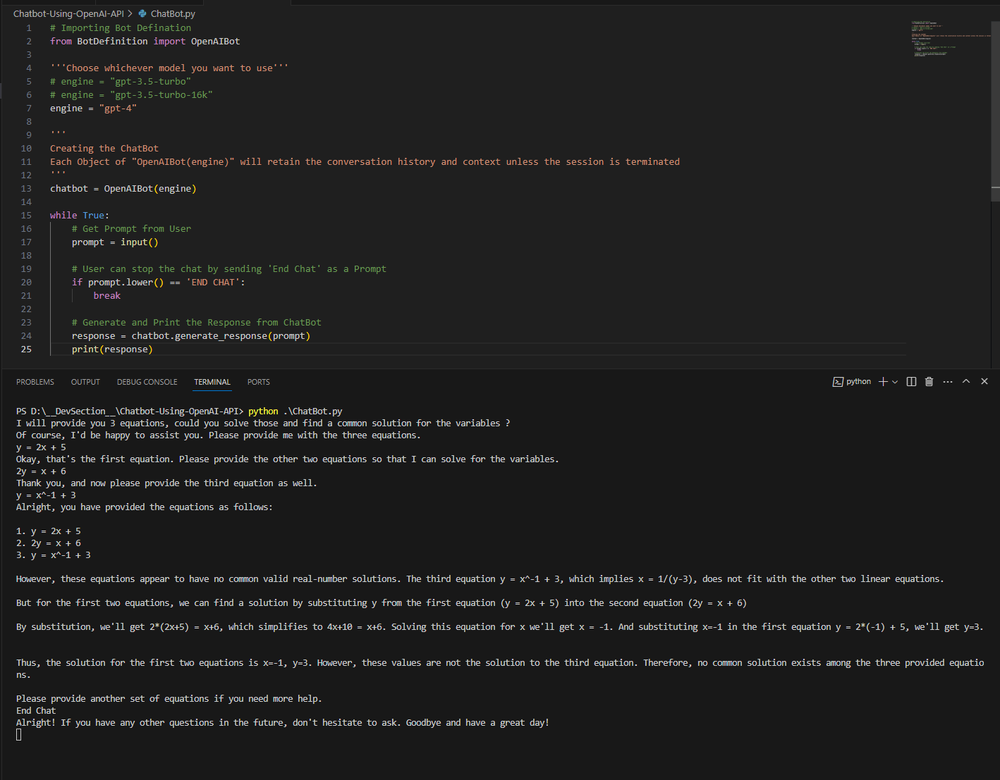

Welcome to MentDost, where we revolve around nurturing your emotional well-being, guiding you towards a brighter mind and heart. 🌟 🌟

# ChatBot using OpenAI (ChatGPT) API (with GUI)
Ready to Use Code to have your own ChatBot using OpenAI API.
 Also added WebApp Template for Reference! Thanks to [Lyubomir](https://github.com/LyubomirT)

### Steps to Use the ChatBot:
- This Codebase requires [OpenAI API Key](https://openai.com/blog/openai-api), kindly make sure you get one.
- Install Necessary Dependencies from 'requirements.txt'. 
    - Run : pip install -r requirements.txt
- Open and Store your API Key in "Code/BotDefinition.py".
- Run "Code/ChatBot.py" for Terminal Based ChatBot.
- Run "Code/GuiChatBot.py" for WebApp Based ChatBot.
- That's it! Just enter your prompts and get the responses.
- If you want to terminate the chat, just enter 'End Chat'.

### How to get the Best out of this Piece of Code:
- Use it in Terminal/CMD for quick response.
- Use it in Jupyter Notebook / Google Colab for more interactive and complex prompts.
- Use it in the BackEnd of any WebApp for enhanced functionality.
- Whatever and However you wish to use it!

### Here is a Sample of How it Works in the Terminal:

